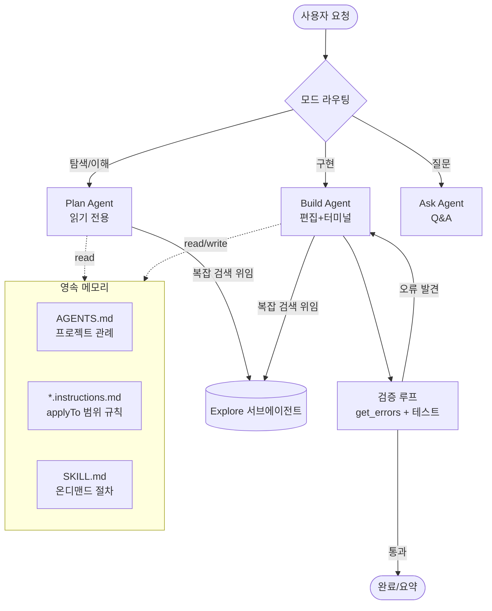
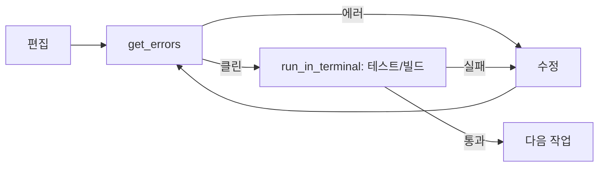

# GHCP 하네스 설계서 (Design Blueprint)

> 입력: [01-harness-research.md](01-harness-research.md)의 베스트 아이디어 종합
> 목표: GitHub Copilot(VS Code Agent) 위에서 **상위 하네스들의 강점을 조립형으로 재현**하는 하네스

---

## 1. 설계 원칙

GHCP는 자체 에이전트 루프·도구·승인 UX를 이미 갖췄다. 따라서 우리는 **새 런타임을 만들지 않고**, GHCP의 커스터마이징 레이어(`*.agent.md`, `*.instructions.md`, `SKILL.md`, 메모리, 서브에이전트)를 이용해 하네스를 "설정"으로 구축한다.

| # | 원칙 | 출처 패턴 |
| --- | --- | --- |
| P1 | **탐색 먼저, 변경은 나중** | cline Plan/Act, opencode plan |
| P2 | **모델을 위한 최소 도구** (ACI·미니멀리즘) | SWE-agent, mini-swe-agent |
| P3 | **프로젝트 메모리를 표준 파일로** | AGENTS.md 수렴 |
| P4 | **안전망: 승인·체크포인트·검증 루프** | cline, codex, aider |
| P5 | **무거운 탐색은 서브에이전트로 격리** | opencode @general |
| P6 | **자기 수정 루프**(오류→수정) | aider lint/test |
| P7 | **검증 = 패치 + 컨테이너 테스트를 북극성으로** | SWE-bench eval 하네스 |
| P8 | **작업별 모델 선택(라우팅)** | claude-code-router |

> **미니멀리즘이 원칙**: mini-swe-agent가 100줄·bash-only로 SWE-bench Verified >74%를 낸다. 따라서 우리 하네스도 "더 많은 레이어"가 아니라 **얼마나 간결한 규칙으로 동작하는가**를 우선한다(P2 강화).

---

## 2. 아키텍처 개요



핵심: **3개 모드(Plan/Build/Ask) + Explore 서브에이전트 + 검증 루프 + 메모리 3종**.

---

## 3. 컴포넌트별 설계

### 3.1 모드(에이전트) 분리 — `*.agent.md`

cline의 Plan/Act, opencode의 build/plan을 GHCP 커스텀 에이전트로 구현한다. 핵심은 **도구 허용 목록(tools)으로 모드의 권한을 강제**하는 것.

| 에이전트 | 역할 | 허용 도구(개념) | 편집 |
| --- | --- | --- | --- |
| **Plan** | 코드베이스 이해·전략 수립 | read_file, grep_search, file_search, semantic_search, runSubagent | ❌ |
| **Build** | 구현·수정 | + 편집 도구, run_in_terminal, get_errors, manage_todo_list | ✅ |
| **Ask** | 빠른 Q&A | 읽기 전용 검색 도구 | ❌ |

> 모드 전환은 사용자가 명시(또는 Plan에서 산출한 계획 승인 후 Build로). 이렇게 하면 "탐색 중 의도치 않은 파일 변경"을 구조적으로 차단(P1, P4).

### 3.2 도구 전략 — ACI 적용 (P2)

SWE-agent의 교훈대로 **GHCP 내장 도구를 모델 친화적으로 "사용 규칙"화**한다(새 도구를 만드는 게 아니라 사용 패턴을 규정).

- 검색 우선순위: 정확 일치 → `grep_search`, 의미 검색 → `semantic_search`, 파일명 → `file_search`.
- 읽기는 **넓은 범위 한 번**으로(작은 read 반복 금지).
- 편집은 다중 편집 시 `multi_replace_string_in_file` 우선.
- 터미널은 **병렬 호출 금지**, 한 번에 하나.

### 3.3 컨텍스트 관리 — Repo Map 근사 (aider 패턴)

GHCP엔 tree-sitter repo map이 없으므로 **2단계 근사**로 대체:
1. `semantic_search`로 관련 영역의 스켈레톤/후보 파일 확보.
2. `grep_search`(정규식 alternation)로 심볼·정의·호출부를 한 번에 좁힘.
3. 큰 파일은 `grep`으로 개요를 먼저, 그 다음 타깃 범위만 `read_file`.

### 3.4 서브에이전트 — Explore 격리 (P5)

opencode `@general`처럼, **불확실하거나 광범위한 탐색은 `runSubagent`(Explore)로 위임**해 메인 컨텍스트를 깨끗이 유지. 호출 시 "무엇을·정밀도(quick/medium/thorough)·반환 형식"을 명시.

### 3.5 안전망 (P4)

- **승인 게이트**: 비가역/공유 영향 작업(push, force, reset --hard, 파일 삭제, 인프라 변경)은 사용자 확인.
- **체크포인트/Undo**: VS Code 변경 추적 + Git 커밋 경계로 롤백 지점 확보.
- **샌드박스 마인드셋**(codex): 셸은 영향 범위를 설명하고 실행.

### 3.6 검증 루프 (P6·P7, aider · SWE-bench)

Build가 편집할 때마다:


> **북극성 = SWE-bench 방식의 검증**: 단순히 "컴파일되는가"가 아니라 **(1) 변경을 패치/diff로 명확히 하고 (2) 관련 테스트를 실제로 돌려 통과하는지**로 완료를 정의한다. 테스트가 없으면 "재현 → 수정 → 회귀 방지 테스트 추가"를 기본 절차로 삼는다. (eval 하네스의 교훈을 런타임 루프로 내면화)

### 3.7 메모리 표준 (P3)

| 파일 | 스코프 | 용도 |
| --- | --- | --- |
| `AGENTS.md` / `.github/copilot-instructions.md` | 레포 전역 | 빌드·테스트 명령, 아키텍처, 컨벤션 |
| `*.instructions.md` (`applyTo`) | 경로/언어별 | 해당 파일군에만 적용되는 규칙 |
| `SKILL.md` | 온디맨드 | 자주 쓰는 절차(릴리스·마이그레이션 등) |

### 3.8 라우팅·모델 선택 (P8, claude-code-router)

claude-code-router처럼 **작업 성격에 따라 모델을 고르는 것**도 하네스의 차원이다. GHCP에서는 별도 라우터를 만들지 않고 **모델 피커 + 에이전트별 권장 모델**로 근사한다.

| 시나리오 | 성격 | 권장 모델 선택 기준 |
| --- | --- | --- |
| `think` | 설계·난이도 높은 추론 | 추론이 강한 고성능 모델 |
| `longContext` | 대형 코드베이스·긴 로그 | 대컨텍스트 모델 |
| `background` | 반복·저비용 작업(포맷·린트) | 빠르고 저비용 모델 |
| `default` | 일반 구현 | 균형 모델 |

> 원칙: "한 모델로 전부"가 아니라 **비용·속도·추론력을 작업에 맞게 교환**. Plan/think는 고추론, Build/background는 실속 모델로 분할하면 품질·비용 균형이 좋아진다.

## 4. 시스템 프롬프트 골격 (모드별 공통 + 차등)

> [system-prompts 모음](https://github.com/x1xhlol/system-prompts-and-models-of-ai-tools)에서 관찰된 베스트 프랙티스를 GHCP 톤에 맞춰 구조화.

공통 블록:
1. **역할·범위** — 무엇을 하고 무엇을 안 하는지.
2. **도구 사용 규칙** — 위 3.2의 우선순위·금지사항.
3. **작업 추적** — 다단계는 `manage_todo_list`로, 한 번에 하나 in-progress.
4. **소통 스타일** — 간결, 파일 링크 규칙 준수.
5. **메모리 참조** — 시작 시 AGENTS.md/instructions 확인.

모드 차등:
- Plan: "절대 파일을 수정하지 말 것. 산출물은 단계별 실행 계획."
- Build: "편집 후 반드시 검증 루프(3.6) 수행."
- Ask: "코드 변경 없이 근거와 함께 답변."

---

## 5. 리포지토리 구조 (제안)

```
harness/
├─ docs/
│  ├─ 01-harness-research.md      # 리서치 (완료)
│  └─ 02-ghcp-harness-design.md   # 본 설계서
├─ .github/
│  └─ copilot-instructions.md     # 레포 전역 규칙(향후)
├─ agents/                        # 모드별 커스텀 에이전트(향후)
│  ├─ plan.agent.md
│  ├─ build.agent.md
│  └─ ask.agent.md
├─ instructions/                  # applyTo 범위별 규칙(향후)
└─ skills/                        # 온디맨드 절차(향후)
```

---

## 6. 비교 요약: 우리 하네스가 취하는 것

| 아이디어 | 출처 | 채택 방식(GHCP) |
| --- | --- | --- |
| Plan/Act 모드 | cline, opencode | `plan.agent.md` / `build.agent.md` (도구 제한) |
| 페르소나 모드 | Roo-Code | Ask + 향후 커스텀 에이전트 확장 |
| ACI·미니멀 도구 | SWE-agent | 내장 도구 사용 규칙화 |
| Repo Map | aider | semantic + grep 2단계 근사 |
| 서브에이전트 | opencode | `runSubagent`(Explore) |
| 체크포인트 | cline | VS Code 변경추적 + Git |
| 검증 루프 | aider | `get_errors` + 터미널 테스트 |
| 메모리 표준 | AGENTS.md 수렴 | AGENTS.md + instructions + SKILL |
| 승인·샌드박스 | codex | 비가역 작업 확인 정책 |
| 라우팅·모델 선택 | claude-code-router | 모델 피커 + 에이전트별 권장 모델(3.8) |
| eval 검증 | SWE-bench | 패치+컨테이너 테스트를 완료 기준으로(3.6) |
| CI 하네스 | claude-code-action | (향후) GitHub Actions 연동 확장 |

---

## 7. 다음 단계(구현 로드맵)

1. `agents/plan.agent.md`, `agents/build.agent.md`, `agents/ask.agent.md` 작성(도구 허용 목록 포함).
2. `.github/copilot-instructions.md`에 검증 루프·도구 규칙·소통 스타일 명문화.
3. 대표 작업(버그 수정·기능 추가)에 대해 Plan→승인→Build→검증 시나리오로 드라이런.
4. 자주 쓰는 절차를 `skills/`로 추출.
5. 필요 시 경로별 `instructions/*.instructions.md` 추가.
6. (향후 확장) **CI 하네스**: claude-code-action처럼 PR/이슈에서 트리거되는 자동 리뷰·구현을 GitHub Actions(또는 Copilot coding agent)로 연동.

> 본 설계서는 "조사→설계 준비" 단계 산출물이다. 실제 에이전트 파일 작성은 위 로드맵 1번부터 진행하면 된다.
