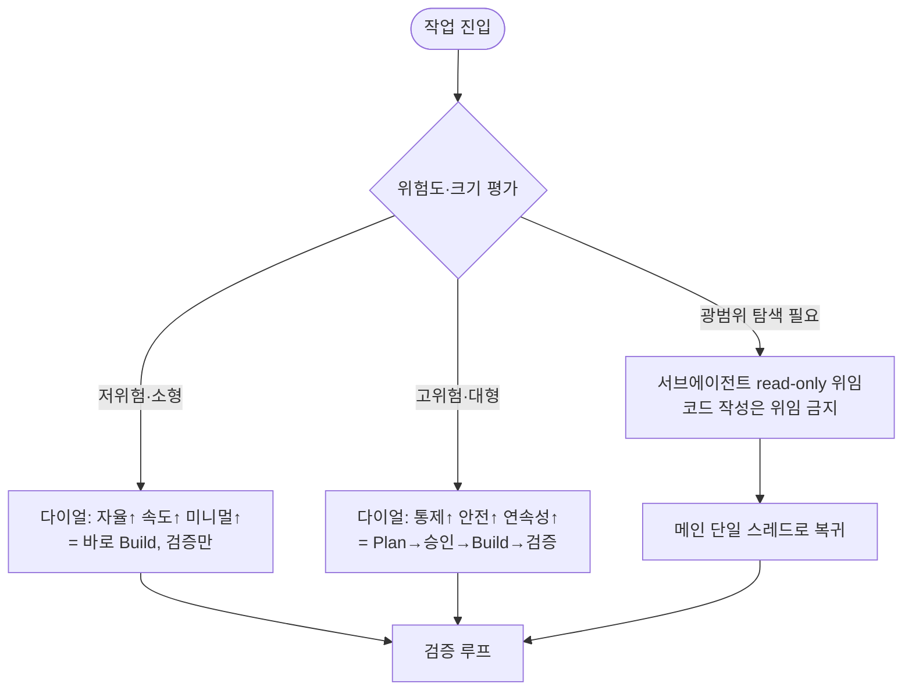

# 하네스 조합 설계: 시너지 & 상충 (Synergy / Conflict)

> 입력: [01-harness-research.md](01-harness-research.md) 베스트 아이디어 15개 + [02-ghcp-harness-design.md](02-ghcp-harness-design.md) 설계 원칙(P1~P8)
> 목적: 상위 하네스의 아이디어를 **조합**할 때 어디서 시너지가 나고 어디서 상충(의도와 다른 결과)이 나는지 규명하고, GHCP에서의 해소 설계를 정한다.
> 외부 근거: Anthropic [Building effective agents](https://www.anthropic.com/engineering/building-effective-agents), Anthropic [Multi-agent research system](https://www.anthropic.com/engineering/multi-agent-research-system), Cognition [Don't Build Multi-Agents](https://cognition.ai/blog/dont-build-multi-agents).

---

## 0. 왜 "조합"을 따로 설계해야 하나

개별 아이디어는 각자 최적이어도, **합치면 서로의 전제를 깨뜨린다.** 예: 자율 실행(auto-approve)은 속도를 위해 "사람을 빼는" 설계인데, 승인 게이트는 안전을 위해 "사람을 넣는" 설계다. 둘을 무지성으로 합치면 *둘 다 약해진다*.

두 가지 외부 원칙이 이 문서의 토대다.

- **"복잡성은 결과가 측정 가능하게 좋아질 때만 추가하라."** (Anthropic, Building effective agents — "add complexity only when it demonstrably improves outcomes")
- **"행동은 암묵적 결정을 담는다. 상충하는 결정은 나쁜 결과를 낳는다."** (Cognition — "Actions carry implicit decisions, and conflicting decisions carry bad results")

즉 조합 설계의 목표는 **기능을 더 얹는 것이 아니라, 서로 충돌하는 암묵적 결정을 제거**하는 것이다.

---

## 1. 핵심 프레임: 모든 상충은 6개 "텐션 축(dial)" 위의 점

상충을 하나씩 외우면 끝이 없다. 대신 **소수의 다이얼**로 환원하고, 다이얼 값을 **전역 고정이 아니라 맥락(모드·위험·작업 크기)에 따라 조절**하는 것이 설계의 핵심이다.

| # | 텐션 축 | 한쪽 끝 (출처) | 반대쪽 끝 (출처) |
| --- | --- | --- | --- |
| D1 | **자율성 ↔ 통제** | auto-approve 자율 실행 (cline) | 휴먼 승인 게이트 (cline·codex) |
| D2 | **미니멀리즘 ↔ 풍부함** | 100줄·bash-only (mini-swe-agent) | 풍부한 도구·LSP·체크포인트 (cline·OpenHands) |
| D3 | **속도 ↔ 안전** | "그냥 실행" (mini-swe-agent) | Plan→승인→Build 게이트 (cline·Roo) |
| D4 | **정밀 ↔ 압축** | Repo Map·정확한 컨텍스트 (aider) | 컨텍스트 컨덴싱·요약 (Roo) |
| D5 | **연속성 ↔ 특화/분산** | 단일 스레드 연속 컨텍스트 (Cognition) | 서브에이전트·모델 라우팅 (opencode·router) |
| D6 | **광범위 수정 ↔ 외과적 변경** | 진행 중 lint/type 일괄 수정 (cline) | 최소 diff·수술적 변경 (aider) |

> **설계 규칙 0**: 어떤 다이얼도 "항상 최대"로 두지 않는다. 각 다이얼의 기본값을 정하고, **모드(Plan/Build/Ask)와 작업 위험·크기로 오버라이드**한다(§6).

---

## 2. 시너지 조합 (서로 강화하는 짝)

아래 조합은 **함께 쓸수록 강해진다.** 우리 GHCP 하네스의 기본 골격으로 채택한다.

| 시너지 조합 | 왜 강화되나 | GHCP 적용 |
| --- | --- | --- |
| **모드 분리(Plan/Build) × 서브에이전트(Explore)** | Plan의 read-only 성격과 Explore의 read-only 위임이 정렬 → 탐색이 메인 컨텍스트를 더럽히지 않음 | Plan/Ask가 `runSubagent(Explore)` 호출 |
| **검증 루프 × 체크포인트/Undo** | 자기수정이 폭주해도 마지막 green 지점으로 롤백 가능 → 자율 편집의 안전망 | `get_errors`+테스트 실패 시 Git 커밋 경계로 복귀 |
| **검증 루프 × eval 북극성(테스트)** | 같은 축의 다른 입자도. "테스트 통과 = 완료" 기준이 자기수정 루프에 명확한 종료조건 제공 | 패치+컨테이너 테스트를 완료 정의로(02 §3.6) |
| **AGENTS.md 메모리 × 규칙/스킬** | 프로젝트 관례가 모든 모드에 일관 주입 → 모드가 바뀌어도 행동 일관 | `AGENTS.md` + `*.instructions.md` |
| **승인 게이트 × 샌드박스** | 비가역 작업은 승인, 블라스트 반경은 샌드박스 → 두 안전층이 직교 보완 | 비가역 작업 확인 + 셸 영향 설명 |
| **Git 통합 × 체크포인트** | 의미 있는 커밋이 곧 롤백 지점 → undo 의미가 명확해짐 | 검증 통과 시에만 커밋, 커밋=체크포인트 |
| **라우팅(모델 선택) × 모드 분리** | Plan=고추론, Build=실속, background=저비용 → 모드가 라우팅 시나리오에 자연 매핑 | 모델 피커 + 에이전트별 권장 모델(02 §3.8) |
| **ACI 도구 설계 × 미니멀리즘** | 모델용으로 잘 설계된 소수 도구 → 결정 표면이 작아 실수 감소 | 내장 도구의 "사용 규칙"화, 새 도구 남발 금지 |

> 근거: Anthropic은 코딩 에이전트가 강한 이유로 "코드가 테스트로 검증 가능 → 테스트 결과를 피드백으로 반복(evaluator-optimizer)"을 든다. 검증 루프 × eval × 체크포인트의 삼각형이 이 구조다.

---

## 3. 상충 조합 (의도와 다른 결과를 내는 짝) — **핵심 섹션**

각 항목: **무엇이 부딪히나 → 왜 의도와 다른 결과 → 근거 → GHCP 해소 설계.**

### C1. auto-approve(자율) ↔ 승인 게이트(통제) — 축 D1
- **충돌**: 한쪽은 사람을 빼서 속도를, 한쪽은 사람을 넣어 안전을 추구.
- **의도와 다른 결과**: auto-approve를 넓게 켜면 승인 게이트가 *우회*되어 "안전하다는 착각"이 생기고, 좁게 켜면 끊임없는 확인으로 *흐름이 끊김*. 둘을 어정쩡하게 합치면 두 이점이 모두 사라짐.
- **해소**: **위험 등급제**. 가역·저영향(파일 편집, 읽기, 테스트 실행)은 자율, **비가역·공유 영향**(push/force, reset --hard, 삭제, 인프라 변경, 비밀)은 항상 승인. 다이얼을 "행동 종류"로 분기한다.

### C2. 컨텍스트 컨덴싱(압축) ↔ Repo Map·검증 루프(정밀) — 축 D4
- **충돌**: 요약은 디테일을 버리는데, Repo Map의 정확한 심볼 참조와 검증 루프가 필요로 하는 **마지막 에러 메시지/테스트 출력/현재 diff**가 그 디테일이다.
- **의도와 다른 결과**: 컨텍스트가 차서 자동 요약이 돌면 "방금 무엇을 왜 바꿨는지"가 사라져, 에이전트가 같은 수정을 반복하거나 회귀를 못 잡음. 재현성도 깨짐.
- **근거**: Cognition은 "압축 모델"을 별도로 두되 *핵심 정보 식별이 어렵다*고 경고. Anthropic도 컨텍스트 한계 시 **계획을 외부 메모리에 저장**해 잘림을 견딘다.
- **해소**: **load-bearing 컨텍스트 보호**. 현재 diff·최근 테스트 출력·활성 파일·계획(plan)은 요약 대상에서 제외하고, **과거 탐색 로그만** 압축. 계획은 `AGENTS.md`/세션 메모리에 외부화.

### C3. 서브에이전트 분산 ↔ 컨텍스트 연속성 — 축 D5 **(가장 위험)**
- **충돌**: 서브에이전트는 격리된 컨텍스트에서 돈다. 메인의 진행 상태·암묵적 결정을 못 본다.
- **의도와 다른 결과**: Cognition의 Flappy Bird 예시 — 서브에이전트1은 배경을, 서브에이전트2는 새를 만들었는데 **스타일이 제각각**이라 합칠 수 없다. "행동은 암묵적 결정을 담는데, 그 결정이 공유되지 않아 상충"한다. 경계에서 결과가 요약되며 정보 손실("game of telephone")도 발생.
- **근거**: Cognition 원칙 1·2(전체 트레이스 공유 / 상충 결정 회피). Anthropic도 "대부분의 코딩 작업은 병렬화 가능한 부분이 적고, LLM은 아직 실시간 협응에 약하다"고 명시.
- **해소(중요)**: 서브에이전트는 **read-only 탐색·질문 전용**(Claude Code 방식). **코드 작성은 절대 위임하지 않는다.** 호출 시 충분한 컨텍스트를 명시 전달하고, 산출물은 메인이 단일 스레드로 흡수해 쓰기를 독점. 큰 산출물은 파일(artifact)로 넘겨 telephone 방지.

### C4. 라우팅(모델 전환) ↔ 일관성·연속성 — 축 D5
- **충돌**: 모델마다 강점·프롬프트 민감도·tool-call 포맷·"문체"가 다르다.
- **의도와 다른 결과**: 작업 *도중* 모델을 바꾸면(think→build→background) 문체·전제가 끊기고, 강한 모델이 세운 계획을 약한 모델이 부실하게 실행하거나, 한 모델에 튜닝된 시스템 프롬프트가 다른 모델에서 저성능을 냄.
- **근거**: Anthropic의 라우팅 워크플로는 **입력을 분류해 경계에서** 라우팅(쉬움→저비용, 어려움→고성능)하지, *한 작업 안에서* 매 스텝 갈아타지 않는다.
- **해소**: 라우팅은 **작업 경계에서만**. 한 작업 내 연속성을 우선하고, 분리 가능한 하위작업(예: 포맷팅·대량 단순수정=background)만 다른 모델로. 모델 전환 시 **전체 컨텍스트 핸드오프**를 강제.

### C5. 미니멀리즘 ↔ 풍부한 도구·안전층 — 축 D2 (철학적 상충)
- **충돌**: mini-swe-agent는 승인 게이트·체크포인트·Repo Map·LSP를 *일부러 빼서* 100줄로 >74%를 낸다. 안전·풍부 도구를 다 얹으면 그 미니멀리즘이 깨진다. 도구가 많을수록 **결정 표면이 커져 모델이 혼란**.
- **의도와 다른 결과**: "안전을 위해" 도구를 늘렸는데 오히려 도구 선택 실수·잘못된 경로로 신뢰도가 떨어짐.
- **근거**: Anthropic "단순함 유지, 결과가 좋아질 때만 복잡성 추가" + ACI(도구를 프롬프트만큼 공들여 설계, poka-yoke).
- **해소**: **미니멀리즘은 "모델이 보는 도구 수와 핵심 루프"에 적용**하고, 안전은 **모델이 추론할 도구가 아니라 루프를 감싸는 정책·게이트**로 구현. 즉 도구 표면은 작게, 안전층은 모델 바깥에.

### C6. 모드 분리 게이트 ↔ 속도·미니멀리즘 — 축 D3
- **충돌**: Plan→승인→Build 왕복은 작은 작업엔 과한 마찰. mini-swe-agent 철학은 "그냥 해라".
- **의도와 다른 결과**: 한 줄 수정에도 계획·승인을 요구해 사용자가 지치고 자율성의 이점이 사라짐.
- **해소**: **게이트는 작업 위험·크기에 비례**. 사소·가역 작업은 Build가 바로 처리, 대형·비가역·아키텍처 변경만 Plan 경유.

### C7. 적극적 lint/type 일괄 수정(cline) ↔ 외과적 최소 diff(aider) — 축 D6
- **충돌**: cline은 진행 중 린트/타입 오류를 적극 고치고, aider는 최소 수술적 변경을 지향.
- **의도와 다른 결과**: 작업과 무관한 코드까지 "개선"해 **노이즈 큰 diff**가 생기고 리뷰·롤백이 어려워짐. PR이 비대해져 회귀 위험↑.
- **해소**: 자동 수정의 **범위를 이번 작업이 건드린 파일로 한정**. "내 변경의 린트 수정"과 "전체 린트 수정"을 분리.

### C8. 검증 루프(적극 자기수정) ↔ 루프 종료·예산 — 축 D3
- **충돌**: 공격적 자기수정은 A를 고치면 B가 깨지는 **두더지잡기(whack-a-mole)** 로 무한 반복 가능. auto-approve와 겹치면 토큰·시간을 태우고 green을 좇다 파괴적 변경까지.
- **근거**: Anthropic "에이전트는 stateful, 오류가 복합(compound)된다 → 정지조건·재시도·체크포인트 같은 결정적 안전장치 필요".
- **해소**: **반복 상한(N회) + N회 후 사람에게 에스컬레이션**. 신규 도입 실패와 **기존부터 깨져 있던 실패를 구분**(기존 실패는 손대지 않음).

### C9. Git 자동 커밋(aider) ↔ 승인 게이트·체크포인트 — 축 D1
- **충돌**: 자동 커밋은 영구 이력을 만든다. 승인 전 변경까지 커밋되면 게이트가 무력화되고, 워킹트리 체크포인트와 커밋 경계의 undo 의미가 엇갈림.
- **의도와 다른 결과**: 자율 편집 × 자동 커밋 = 노이즈 커밋 폭증, 되돌리기 혼란.
- **해소**: **검증 통과한 마일스톤에서만 커밋.** 워킹트리 체크포인트(작업 중 롤백)와 커밋 경계(승인된 단위)를 명확히 분리.

### C10. 다중 메모리 소스(AGENTS.md + instructions + SKILL + copilot-instructions) ↔ 컨텍스트 예산·일관성 — 축 D2/D4
- **충돌**: 항상 로드되는 지침 파일이 많아지면 서로 **모순**(한 파일은 관례 A, 다른 파일은 A')되고 컨텍스트를 잠식.
- **의도와 다른 결과**: 우선순위 모호로 에이전트가 어떤 규칙을 따를지 흔들림.
- **해소**: **명확한 우선순위 계층**(좁은 범위 `applyTo` > 전역) + **항상 로드 메모리는 최소**, 나머지는 `SKILL.md`로 온디맨드.

### C11. CI 하네스(무인·헤드리스) ↔ 휴먼 승인 게이트 — 축 D1
- **충돌**: CI는 사람이 없는데 승인 게이트는 상호작용을 전제.
- **의도와 다른 결과**: 인터랙티브 하네스를 그대로 CI에 올리면 승인 대기에서 멈추거나, 게이트를 빼면서 안전이 통째로 증발.
- **해소**: CI에서는 승인 게이트를 **엄격한 권한 allowlist + 샌드박스 + PR의 구조화 출력 리뷰**로 치환(claude-code-action 방식).

### C12. 이벤트스트림 조립형 코어(OpenHands) ↔ "새 런타임 금지"(GHCP) — 축 D2
- **충돌**: OpenHands식 무거운 SDK 채택은 "설정으로 만들고 런타임은 새로 짜지 않는다"는 02 설계와 정면 충돌.
- **해소**: 아키텍처 *기계*가 아니라 *개념*(관찰/행동 규율, 정지조건)만 차용.

---

## 4. 조합 상호작용 한눈에 보기

`++`강한 시너지 · `+`약한 시너지 · `0`중립 · `–`주의(상충, 조건부) · `––`강한 상충(해소 설계 필수)

| | 모드분리 | auto-approve | 승인게이트 | 서브에이전트 | 컨덴싱 | 검증루프 | 라우팅 | 광범위lint |
| --- | :--: | :--: | :--: | :--: | :--: | :--: | :--: | :--: |
| **모드분리** | — | + | ++ | ++ | 0 | + | ++ | 0 |
| **auto-approve** | + | — | –– (C1) | 0 | 0 | – (C8) | 0 | – (C7) |
| **승인게이트** | ++ | –– (C1) | — | + | 0 | ++ | 0 | + |
| **서브에이전트** | ++ | 0 | + | — | + | 0 | – (C4) | 0 |
| **컨덴싱** | 0 | 0 | 0 | + | — | –– (C2) | – | 0 |
| **검증루프** | + | – (C8) | ++ | 0 | –– (C2) | — | 0 | – (C7) |
| **라우팅** | ++ | 0 | 0 | – (C4) | – | 0 | — | 0 |
| **광범위lint** | 0 | – (C7) | + | 0 | 0 | – (C7) | 0 | — |

읽는 법: `––`/`–` 칸은 **반드시 §3의 해소 설계를 적용**해야 의도대로 동작한다. `++` 칸은 기본 골격으로 적극 결합한다.

---

## 5. 가장 중요한 결론: **코딩에 멀티에이전트·중간 모델전환을 함부로 쓰지 마라**

조사에서 가장 강한 신호. 표면적으로 상반돼 보이는 두 권위 자료가 **코딩 작업에 대해선 같은 결론**을 낸다.

| | Cognition (Don't Build Multi-Agents) | Anthropic (Multi-agent research) |
| --- | --- | --- |
| 핵심 주장 | 멀티에이전트는 컨텍스트 분절로 **상충 결정**을 낳아 깨지기 쉽다 | 멀티에이전트는 **병렬 리서치**엔 단일 대비 +90.2% |
| 비용 | 신뢰성 비용이 큼 | 챗 대비 **약 15배 토큰** |
| **코딩에 대한 입장** | 단일 스레드 선형 에이전트를 디폴트로 | "**대부분의 코딩은 병렬화 가능한 작업이 적고**, LLM은 실시간 협응에 약함" |
| 서브에이전트 용법 | Claude Code: **읽기/질문만**, 병렬 코드작성 안 함 | 서브에이전트=별도 컨텍스트로 **압축**, 산출은 파일로 |

**→ 우리 하네스의 확정 결론**
1. **코드 작성은 단일 스레드.** 서브에이전트(Explore)는 read-only 탐색·질문에만.
2. **모델 라우팅은 작업 경계에서만.** 한 작업 도중 모델을 갈아타지 않는다.
3. 병렬화가 정당한 경우는 **독립적이고 읽기 전용인 탐색**(예: 여러 모듈 동시 조사)뿐. 그때도 결과는 메인이 단일 스레드로 통합한다.
4. 멀티에이전트는 "토큰을 더 써서 푸는" 고비용 도구다 — **가치 큰·병렬성 큰 작업에만**, 코딩 일반작업엔 기본 비채택.

---

## 6. 해소 원칙 → GHCP 권장 기본 구성 (다이얼 디폴트 표)

다이얼을 모드·위험으로 설정한다. **충돌 시 우선순위: 연속성 > 통제·검증 > 속도 > 자율.**

| 다이얼 | Ask | Plan | Build (소형·가역) | Build (대형·비가역) |
| --- | --- | --- | --- | --- |
| D1 자율↔통제 | 통제(읽기전용) | 통제(읽기전용) | 자율(가역만) | 통제(비가역 승인) |
| D2 미니멀↔풍부 | 미니멀 | 미니멀 | 미니멀 코어 + 정책층 | 미니멀 코어 + 정책층 |
| D3 속도↔안전 | 속도 | 안전(계획 산출) | 속도(바로 실행) | 안전(Plan 경유) |
| D4 정밀↔압축 | 압축 허용 | 정밀(탐색 보존) | 정밀(diff·테스트 보호) | 정밀 + 계획 외부화 |
| D5 연속성↔분산 | 단일 | 단일 + Explore(RO) | 단일 | 단일 + Explore(RO) |
| D6 광범위↔외과적 | — | — | 외과적(건드린 파일만) | 외과적 + 별도 정리 PR |

**불변 규칙(모드 무관)**
- 서브에이전트는 read-only. 코드 쓰기 위임 금지(C3).
- 라우팅은 작업 경계에서만, 전환 시 컨텍스트 핸드오프(C4).
- load-bearing 컨텍스트(현재 diff·테스트 출력·계획)는 요약 금지(C2).
- 검증 루프는 반복 상한 + 에스컬레이션, 기존 실패와 신규 실패 구분(C8).
- 커밋은 검증 통과 마일스톤에서만(C9).

---

## 7. 안티패턴 카탈로그 (하지 말 것)

| 안티패턴 | 왜 나쁜가 | 대신 |
| --- | --- | --- |
| 모든 작업에 auto-approve 전역 ON | 비가역 사고 + 게이트 무력화 (C1) | 위험 등급제로 가역만 자율 |
| 코드 작성을 병렬 서브에이전트에 위임 | 상충 결정·스타일 분열 (C3,§5) | RO 탐색만 위임, 쓰기는 단일 스레드 |
| 작업 도중 모델 갈아타기 | 연속성·전제 붕괴 (C4) | 경계에서만 라우팅 |
| 컨텍스트 차면 전부 요약 | diff·테스트·계획 손실 (C2) | load-bearing 보존, 과거만 압축 |
| "안전" 명목으로 도구 무한 추가 | 결정 표면↑ 실수↑ (C5) | 도구는 작게, 안전은 정책으로 |
| 한 줄 수정에도 Plan→승인 강제 | 마찰·자율성 상실 (C6) | 게이트는 위험·크기 비례 |
| lint 김에 무관 코드 일괄 수정 | 노이즈 diff·회귀 (C7) | 건드린 파일로 범위 한정 |
| green 될 때까지 무한 자기수정 | 두더지잡기·예산 폭주 (C8) | 반복 상한 + 에스컬레이션 |
| 지침 파일 남발 | 모순·컨텍스트 잠식 (C10) | 우선순위 계층 + 온디맨드 |

---

## 8. 다음 단계

1. 이 다이얼 디폴트(§6)를 [02-ghcp-harness-design.md](02-ghcp-harness-design.md) 7장 로드맵의 `*.agent.md`에 반영(에이전트별 도구 허용·금지로 D1·D5 강제).
2. 불변 규칙을 `.github/copilot-instructions.md`에 명문화(C2·C3·C4·C8·C9).
3. 대표 시나리오로 드라이런하며 상충 매트릭스(§4)의 `–`/`––` 칸이 실제로 해소되는지 검증.

> 요지: **좋은 하네스는 기능의 합이 아니라, 충돌하는 암묵적 결정을 제거한 결과다.** 우리는 시너지 짝(§2)을 골격으로, 상충 짝(§3)은 다이얼·정책으로 무력화한다.
